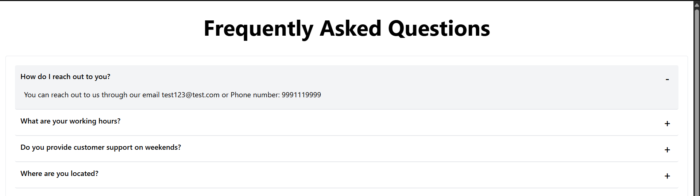

# FAQ Section

A general Frequently Asked Questions (FAQ) section commonly seen on websites. A list of questions is displayed on the page, where initially only the questions are visible to the user. When the user clicks on any FAQ item, the corresponding answer expands and becomes visible

## Prerequisites:

- Node.js installed.

# Technologies Used:

- React JS
- TypeScript
- Tailwind CSS