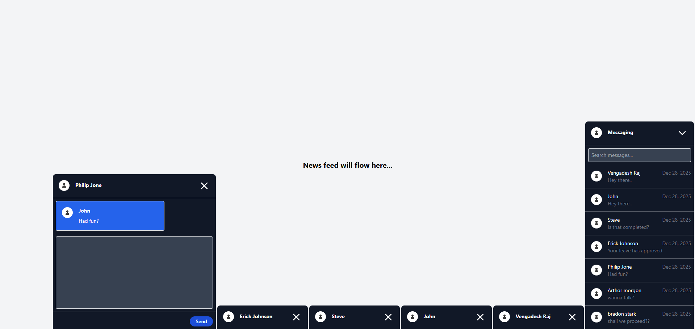

# LinkedIn chat section

A chat section you see on linkedIn. No third-party libraries used.

- A floating chat panel stays on top of the news feed.
- Clicking the header (up-arrow) reveals the list of available chats.
- Selecting a chat opens it in a separate modal window.
- You can open multiple chat modals at once.
- When more than five chat modals are opened, the oldest modal is automatically closed to keep the screen clean.
- Chats can be searched by username or by message content.

## Technologies Used:
- React JS
- Tailwind CSS

## Dev concepts used:

- Debouncing used in message search option in chat.
- e.stopPropagation() to stop propagation at modal close button.

