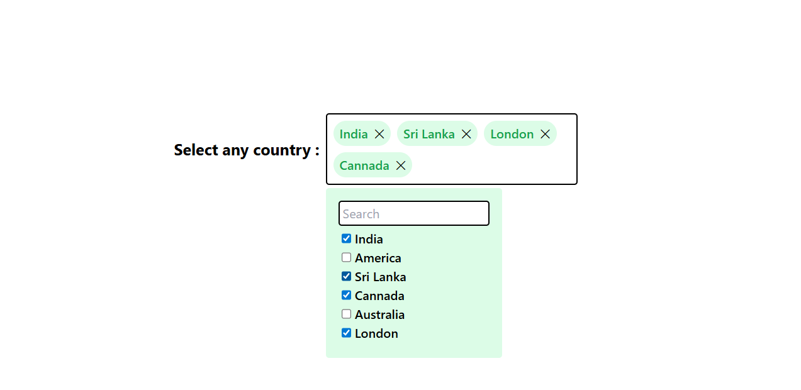

# Multi Select Dropdown

A multi-select dropdown allows users to select multiple options from a list, displaying chosen items within the input field.

## Prerequisites:

- Node.js installed.

## Technologies Used:

- React JS
- Tailwind CSS
- Debounced Search
- event listener on dom to handle outside click
