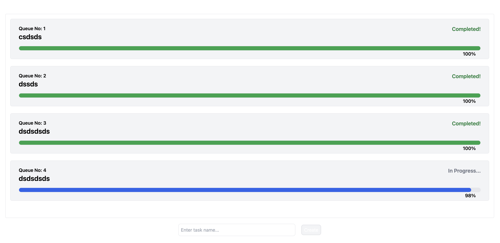

# Queue Tasks

Mimics a simple queuing task functionality. The user has to enter a name for the task and click the Create button. A new task will be queued with a progress bar, and the progress will increase percentage by percentage. Once the task is completed, it will turn green. Also, while one task is in progress, the user can queue multiple additional tasks.

## Prerequisites:

- Node.js installed.

## Technologies Used:

- React JS
- CSS