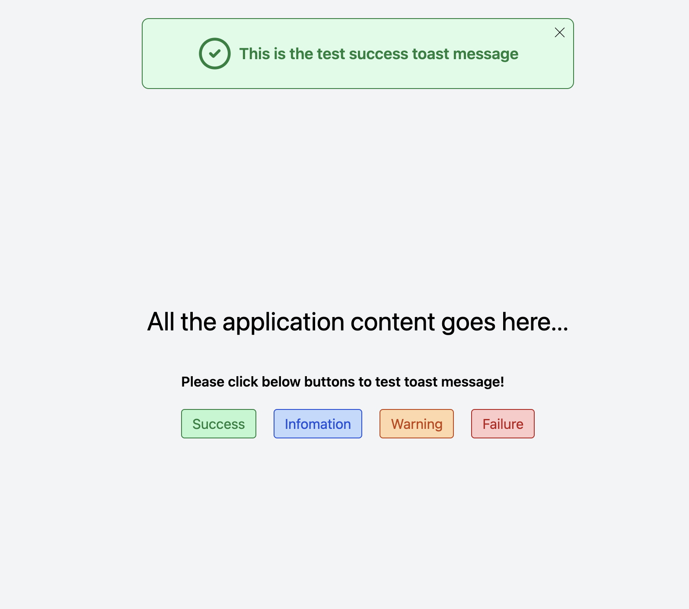

# Toast Message

A toast message is a small notification shown on a website to inform users about an action or operation. It appears briefly at the top of the screen and closes automatically after a few seconds. Common types include success, warning, information, and failure messages.

## Technologies Used:

- React JS
- Tailwind CSS