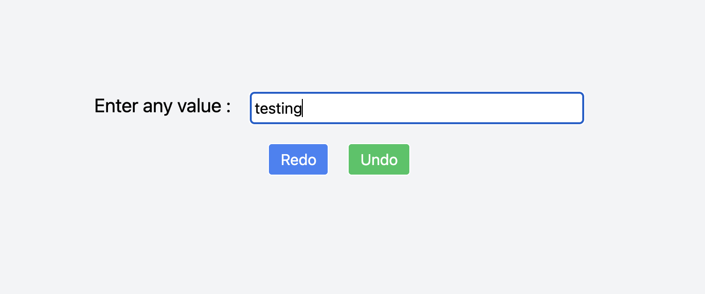

# UnDo Redo

A text box with Undo and Redo buttons. Undo removes the last typed character (like backspace), and Redo restores the most recently undone character.

## Technologies Used:

- React JS
- Tailwind CSS