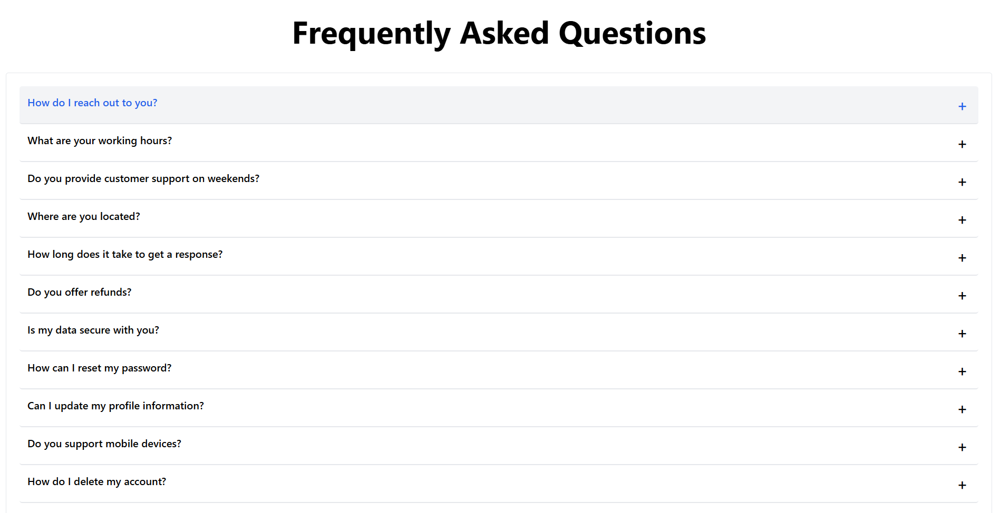

# FAQ Section

General frequently asked questions section you see on the different websites, List of faqs will be displayed in the page. initially questions only visible to the user. once user click on any one of the faq the answer will be displayed to the user.

## Prerequisites:

- Node.js installed.

# Technologies Used:

- React JS
- TypeScript
- Tailwind CSS