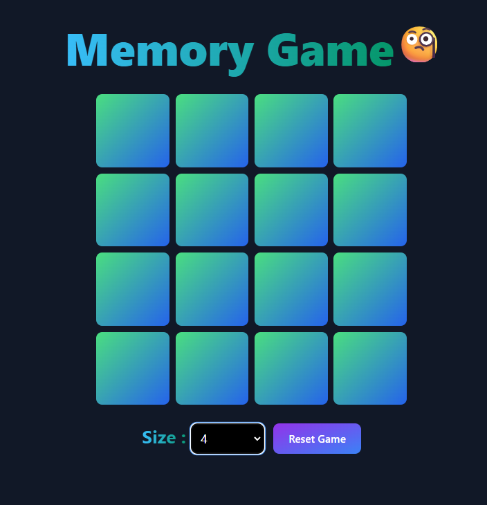

# Find Pair Card - Card Matching Memory Game

The number of cards is displayed based on the player’s selected size. When the player clicks on a card, it reveals a number. A matching pair of that number exists among the remaining cards. If the player selects another card with the same number, both cards remain revealed. However, if the player selects a card with a different number, both cards are flipped back and remain hidden.

## Prerequisites:

- Node.js installed.

## Technologies Used:

- React JS
- Tailwind CSS

* To play: https://card-matching-memory-game.onrender.com/