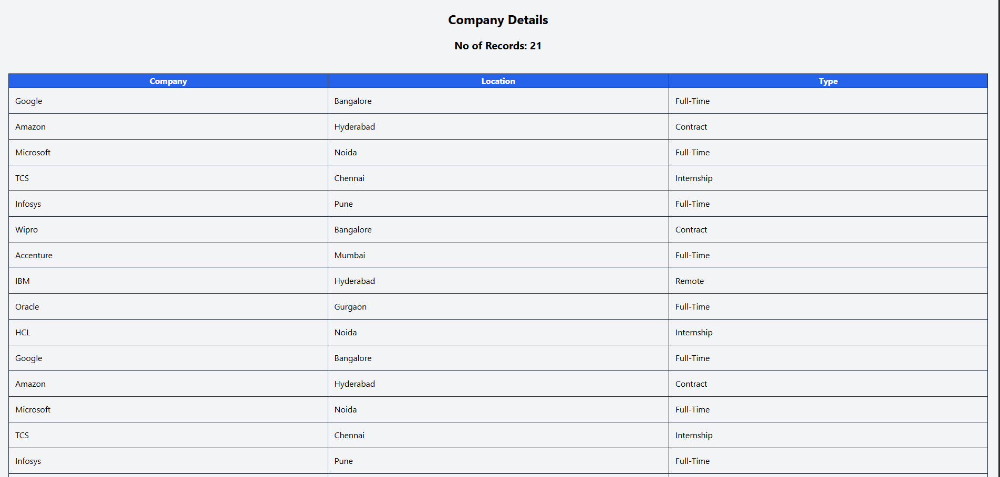
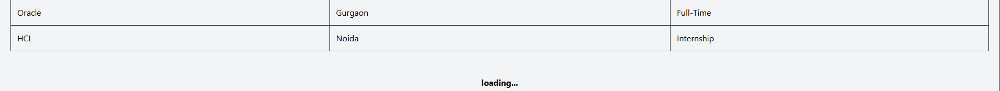

# Infinite Scroll

A grid that displays a list of company records with infinite scrolling. As you reach the bottom of the page, the next set of records is automatically fetched and appended to the existing list. A throttling mechanism is implemented to prevent unnecessary and repeated re-fetching

## Technologies Used:
- React JS
- TailWind CSS
- 
 Throttling mechanism 
