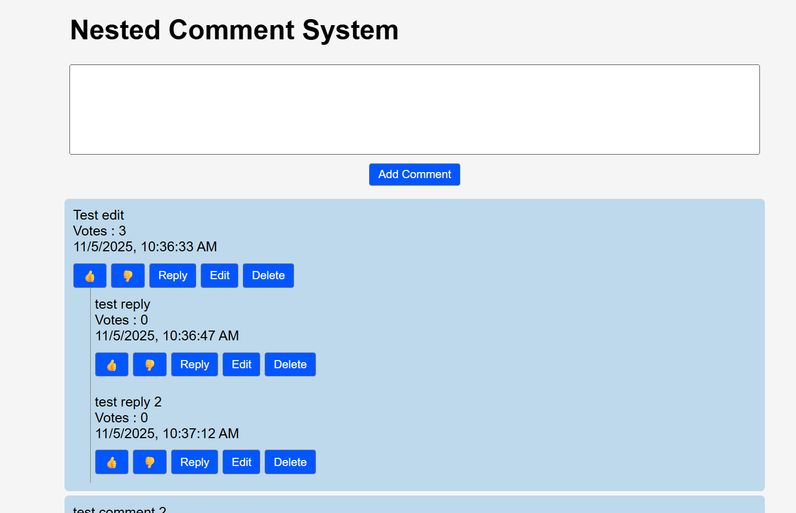

# Nested Comments Section

A Comment section let you submit a new comment and allows you to reply,edit,delete,up-vote and down-vote comments,All the reply comments will be displayed in nested format.

## Prerequisites:

- Node.js installed.

## Technologies Used:

- React JS
- CSS