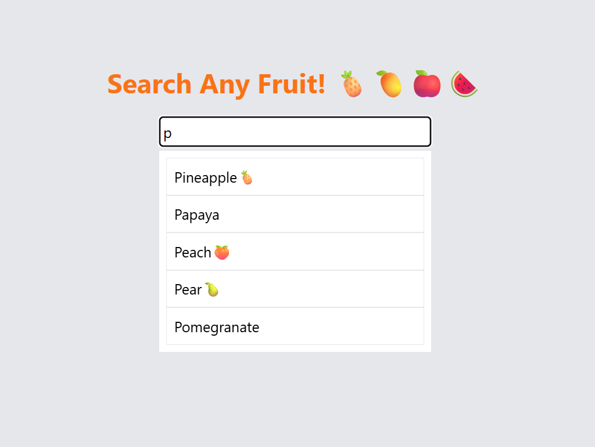

# Searchable Text Box

A searchable text box that allows users to look up fruits, displaying dynamic suggestions based on their input. The component uses a debouncing mechanism to minimize unnecessary event triggers and improve performance.

## Technologies Used:

- React JS
- Tailwind CSS
- Debouncing mechanism