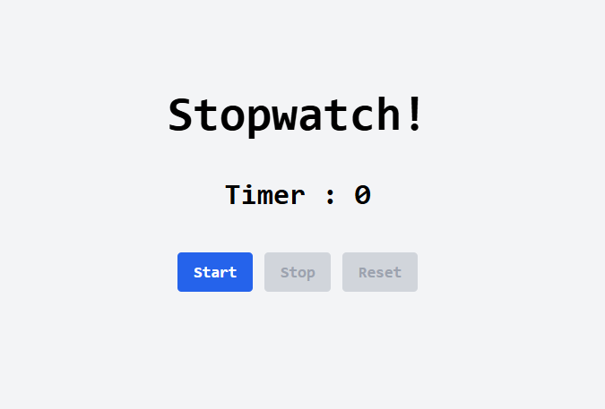

# Stopwatch 

To start the timer, click the Start button, it will increase second by second. The Stop button pauses the timer, and the Reset button clears it.

## Prerequisites:

- Node.js installed.

# Technologies Used:

- React JS
- Tailwind CSS