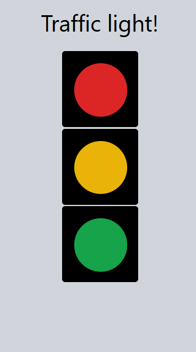

# Traffic Light

A similar implementation of a traffic light signal can be seen on roads, only the time durations differ. Initially, the red light is displayed for 3 seconds, followed by yellow for 0.5 seconds and green for 4 seconds.

# Prerequisites:

- Node.js installed.

## Technologies Used:

- React JS
- Tailwind CSS